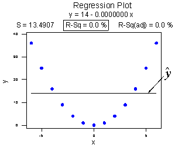

# Coefficient of Determination

## Introduction
For linear regression analysis, as we saw earlier, the straight does not **fully** describe the relationship between variables and there is always some error. In order to determine the "goodness of fit** of the fitted line, we need some measure to show the predictive performance of the model. In this lesson, we shall look at R2 (pronounced r squared) as a coefficient of determination for our fitted model.

## Objectives
You will be able to:

* Describe squared error as means to identify the difference between predicted and actual values

* Calculate the coefficient of deteremination (R-squared) for a given regression line

## R-Squared
> **R-squared or coefficient of determination is a statistical measure that is used to assess the goodness of fit of a regression model.**

Here is how it works. R-squared uses a baseline model which is the **worst** model. This baseline model does not make use of any independent variables to predict the value of dependent variable Y. Instead it uses the **mean** of the observed responses of dependent variable Y and always predicts this mean as the value of Y. Pretty silly ! well thats why its the WORST model. 

The red line in the above figure is the baseline model that always predicts mean of Y as the value of Y **irrespective** of the value of the independent variables. The green line is our fitted model which makes use of X values to predict the values of Y. Looking at the plot above , R-squared simply asks the question:

>**Can you do better than the baseline ?**

Any regression model that we fit is compared to this baseline model to understand it’s **goodness of fit**. Simply put, R-squared just explains how good is your model when compared to the baseline model. Thats about it. 

#### Great, so how do I calculate R-squared ?

The mathematical formula to calculate R-squared for a linear regression line is in terms of **squared errors** for the fitted model and the baseline model. It's calculated as :

* SSRES is the **residual** sum of squared errors of our regression model also known as **SSE** (Sum of Squared Errors). It is the error between real and predicted values. 

* SSTOT i.e. the difference between real and mean y values. **Total** sum of squared error , calculated from the baseline model. This is also known as **SST** (Sum pf Squared Total)

Below is a graphical depiction of these errors and how R2 is calculated from these. 

#### And how do we interpret the outcome of R2

Our worst possible regression model could be the baseline model itself .Hence SSE would be equal to SST looking at the graph above. Hence our R_squared value will become 0. Look at the plot below: 

Due to this particular shape of the distribution, the regression line (y_hat) is same as the mean line for (y_bar). And this would result as 0. A regression model cant get any worse than this. 

Similarly, the best model would be the one that fits all the data points perfectly so SSE in this case would be 0. R-squared = 1–0 = 1 which indicates a perfect model. Below is an example of this (although this would rarely happen with real world data).

> **R-squared can take value between 0 and 1 where values closer to 0 represent a poor fit and values closer to 1 represent a perfect fit**

#### Phrasing R_squared values 

An obtained R-squared value of say 0.85 can be put into a statement as 

> ***85% variations in dependent variable Y is explained by the independent variable present in our model.***

## Summary 
In this lesson, we looked at the R-squared, co-efficient of determination to evaluate the goodness of fit for a regression line. We saw how R-squared is calculated by comparing a given model to a baseline model and indicating it with values between 0 and 1. In the next lab, we shall move on to calculating R-squared in python. 
